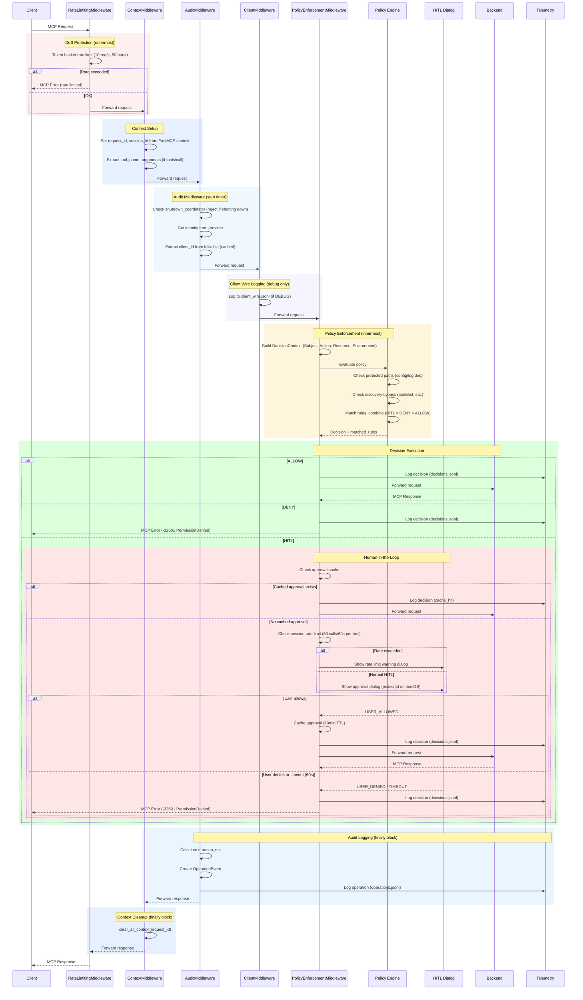
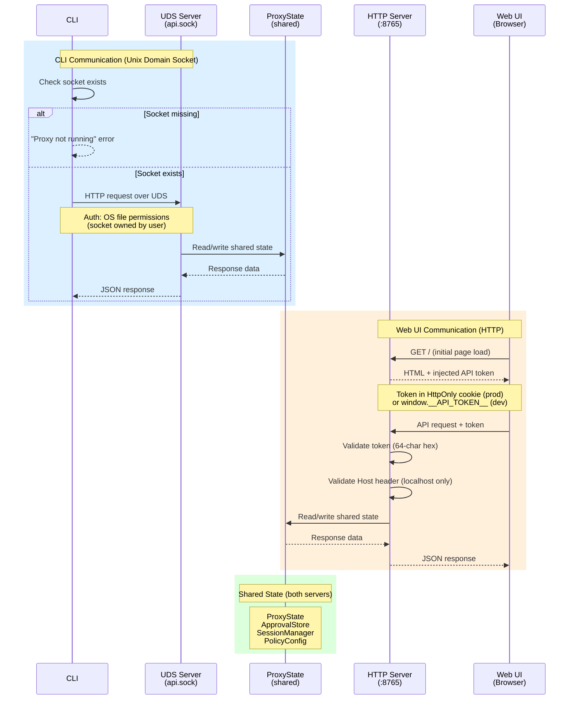
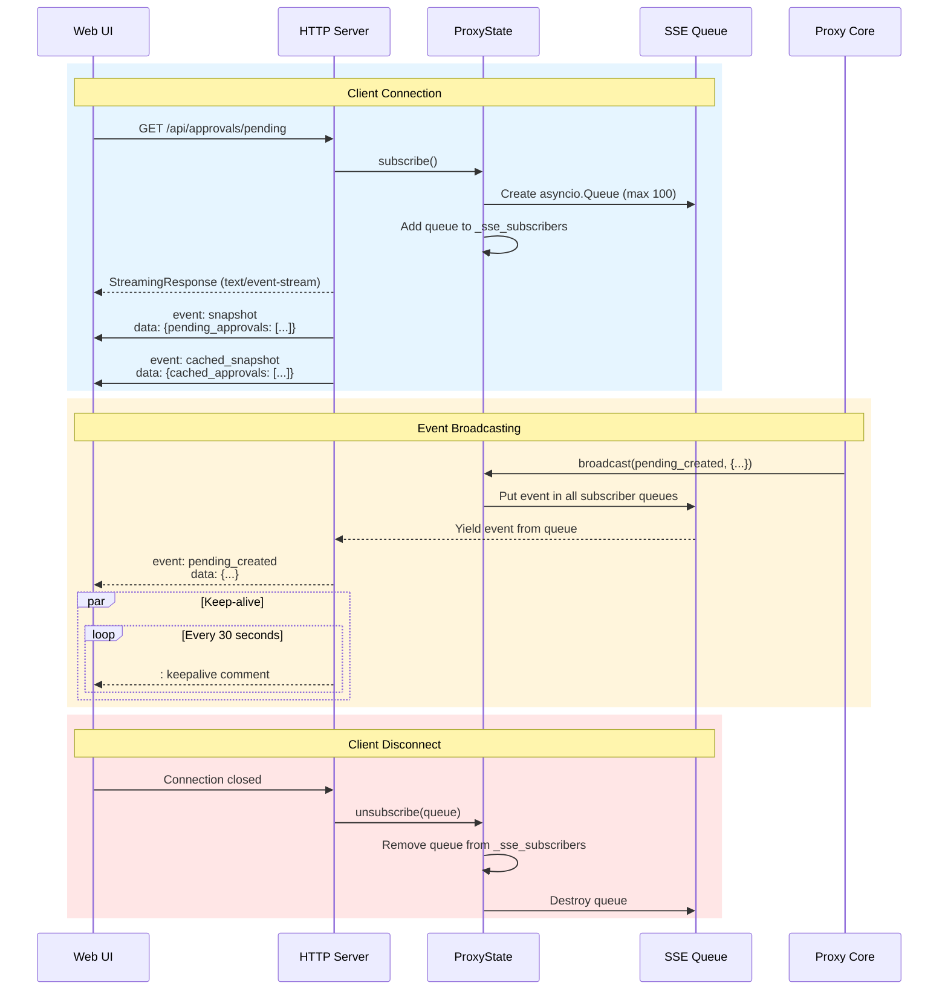

# MCP ACP Lifecycle

```mermaid
sequenceDiagram
    participant Client as Client (Claude Desktop)
    participant Proxy as Proxy
    participant Backend as Backend MCP Server
    participant Logs as Telemetry
    participant Keychain as OS Keychain

    rect rgb(200, 220, 255)
    note over Client,Keychain: Initialization Phase

    Proxy->>Proxy: Load AppConfig & PolicyConfig
    Proxy->>Logs: Validate audit logs writable (fail if not)
    Proxy->>Proxy: Device health check (FileVault, SIP)

    alt Device unhealthy
        Proxy->>Proxy: Show error popup
        Proxy->>Proxy: Raise DeviceHealthError (exit 14)
    end

    Proxy->>Proxy: Create ShutdownCoordinator
    Proxy->>Proxy: Create AuditHealthMonitor (30s interval)
    Proxy->>Proxy: Create DeviceHealthMonitor (5min interval)

    rect rgb(220, 235, 255)
    note over Proxy,Backend: Transport Setup
    alt transport = auto
        alt Both HTTP and STDIO configured
            Proxy->>Backend: HTTP health check
            alt HTTP reachable
                Proxy->>Proxy: Select HTTP transport
            else HTTP unreachable
                Proxy->>Proxy: Fall back to STDIO transport
            end
        else HTTP only configured
            Proxy->>Backend: HTTP health check (must succeed)
            Proxy->>Proxy: Select HTTP transport
        else STDIO only configured
            Proxy->>Proxy: Select STDIO transport
        end
    end
    end

    Proxy->>Proxy: Create SessionManager
    Proxy->>Proxy: Create SessionRateTracker
    Proxy->>Proxy: Create OIDCIdentityProvider (config only, no token load yet)
    Proxy->>Proxy: Register middleware chain
    end

    rect rgb(210, 235, 255)
    note over Client,Logs: Lifespan Start (proxy_lifespan)

    Proxy->>Proxy: Start AuditHealthMonitor
    Proxy->>Proxy: Start DeviceHealthMonitor

    rect rgb(220, 240, 255)
    note over Proxy,Keychain: Token Validation
    Proxy->>Keychain: get_identity() loads token
    Keychain-->>Proxy: JWT (access + refresh token)
    Proxy->>Proxy: Validate token (signature, expiry, claims)
    alt Token expired
        Proxy->>Keychain: Refresh token automatically
        alt Refresh failed
            Proxy->>Logs: Log session_ended (auth_expired)
            Proxy->>Proxy: Show error popup, exit 13
        end
    end
    alt No token found
        Proxy->>Proxy: Show error popup
        Proxy->>Proxy: Raise AuthenticationError (exit 13)
    end
    end

    Proxy->>Proxy: Create user-bound session (<user_id>:<uuid>)
    Proxy->>Logs: Log session_started (auth.jsonl)
    Proxy->>Proxy: Setup SIGHUP handler (policy hot reload)

    par Background Monitors Running
        Note over Proxy: AuditHealthMonitor checks every 30s
        Note over Proxy: DeviceHealthMonitor checks every 5min
    end
    end

    rect rgb(200, 240, 220)
    note over Client,Logs: MCP Session Handshake

    Client->>Proxy: initialize (stdio)
    Proxy->>Backend: initialize (selected transport)
    Backend-->>Proxy: InitializeResult (serverInfo, capabilities)
    Proxy->>Proxy: Cache client name for session
    Proxy-->>Client: InitializeResult (serverInfo, capabilities)
    Proxy->>Logs: Log initialization metadata

    Client->>Proxy: notifications/initialized
    Proxy->>Backend: notifications/initialized
    end

    rect rgb(200, 255, 220)
    note over Client,Logs: Operation Phase

    Client->>Proxy: MCP Request (stdio)
    Proxy->>Proxy: Middleware chain (see Operation Phase diagram)
    Proxy->>Backend: MCP Request (if allowed)
    Backend-->>Proxy: MCP Response
    Proxy->>Logs: Log operation & decision
    Proxy-->>Client: MCP Response (stdio)
    end

    rect rgb(255, 220, 200)
    note over Client,Keychain: Shutdown Phase

    alt Normal Shutdown
        Client->>Proxy: close connection
        Proxy->>Proxy: Remove SIGHUP handler
        Proxy->>Proxy: Stop DeviceHealthMonitor
        Proxy->>Proxy: Stop AuditHealthMonitor
        Proxy->>Logs: Log session_ended (end_reason: normal)
        Proxy->>Proxy: Invalidate bound session
        Proxy->>Proxy: Clear rate tracking data
        Proxy->>Backend: close connection
        Backend-->>Proxy: exit
        Proxy-->>Client: exit
    else Audit Integrity Failure
        Proxy->>Logs: Log critical event (best effort)
        Proxy->>Proxy: Write .last_crash breadcrumb
        Proxy-->>Client: MCP Error
        Proxy->>Proxy: os._exit(10)
    else Device Health Failure
        Proxy->>Logs: Log device_health_failed
        Proxy->>Logs: Log session_ended (device_posture)
        Proxy->>Proxy: Trigger graceful shutdown
    else Session Binding Violation
        Proxy->>Logs: Log session_ended (session_binding_violation)
        Proxy->>Proxy: Write .last_crash breadcrumb
        Proxy->>Proxy: os._exit(15)
    end
    end
```

# MCP ACP Operation Phase

```mermaid
sequenceDiagram
    participant Client as Client
    participant DOS as RateLimitingMiddleware
    participant CTX as ContextMiddleware
    participant AUD as AuditMiddleware
    participant WIRE as ClientMiddleware
    participant PEP as PolicyEnforcementMiddleware
    participant PDP as Policy Engine
    participant HITL as HITL Dialog
    participant Backend as Backend
    participant Logs as Telemetry

    Client->>DOS: MCP Request

    rect rgb(255, 240, 240)
    note over DOS: DoS Protection (outermost)
    DOS->>DOS: Token bucket rate limit (10 req/s, 50 burst)
    alt Rate exceeded
        DOS-->>Client: MCP Error (rate limited)
    else OK
        DOS->>CTX: Forward request
    end
    end

    rect rgb(230, 240, 255)
    note over CTX: Context Setup
    CTX->>CTX: Set request_id, session_id from FastMCP context
    CTX->>CTX: Extract tool_name, arguments (if tools/call)
    CTX->>AUD: Forward request
    end

    rect rgb(240, 248, 255)
    note over AUD: Audit Middleware (start timer)
    AUD->>AUD: Check shutdown_coordinator (reject if shutting down)
    AUD->>AUD: Get identity from provider
    AUD->>AUD: Extract client_id from initialize (cached)
    AUD->>WIRE: Forward request
    end

    rect rgb(245, 245, 255)
    note over WIRE: Client Wire Logging (debug only)
    WIRE->>WIRE: Log to client_wire.jsonl (if DEBUG)
    WIRE->>PEP: Forward request
    end

    rect rgb(255, 245, 220)
    note over PEP,PDP: Policy Enforcement (innermost)

    PEP->>PEP: Build DecisionContext (Subject, Action, Resource, Environment)
    PEP->>PDP: Evaluate policy
    PDP->>PDP: Check protected paths (config/log dirs)
    PDP->>PDP: Check discovery bypass (tools/list, etc.)
    PDP->>PDP: Match rules, combine (HITL > DENY > ALLOW)
    PDP-->>PEP: Decision + matched_rules
    end

    rect rgb(220, 255, 220)
    note over PEP,Backend: Decision Execution

    alt ALLOW
        PEP->>Logs: Log decision (decisions.jsonl)
        PEP->>Backend: Forward request
        Backend-->>PEP: MCP Response
    else DENY
        PEP->>Logs: Log decision (decisions.jsonl)
        PEP-->>Client: MCP Error (-32601 PermissionDenied)
    else HITL
        rect rgb(255, 230, 230)
        note over PEP,HITL: Human-in-the-Loop
        PEP->>PEP: Check approval cache
        alt Cached approval exists
            PEP->>Logs: Log decision (cache_hit)
            PEP->>Backend: Forward request
        else No cached approval
            PEP->>PEP: Check session rate limit (30 calls/60s per tool)
            alt Rate exceeded
                PEP->>HITL: Show rate limit warning dialog
            else Normal HITL
                PEP->>HITL: Show approval dialog (osascript on macOS)
            end
            alt User allows
                HITL-->>PEP: USER_ALLOWED
                PEP->>PEP: Cache approval (10min TTL)
                PEP->>Logs: Log decision (decisions.jsonl)
                PEP->>Backend: Forward request
                Backend-->>PEP: MCP Response
            else User denies or timeout (60s)
                HITL-->>PEP: USER_DENIED / TIMEOUT
                PEP->>Logs: Log decision (decisions.jsonl)
                PEP-->>Client: MCP Error (-32601 PermissionDenied)
            end
        end
        end
    end
    end

    rect rgb(235, 245, 255)
    note over AUD,Logs: Audit Logging (finally block)
    AUD->>AUD: Calculate duration_ms
    AUD->>AUD: Create OperationEvent
    AUD->>Logs: Log operation (operations.jsonl)
    AUD-->>CTX: Forward response
    end

    rect rgb(230, 240, 255)
    note over CTX: Context Cleanup (finally block)
    CTX->>CTX: clear_all_context(request_id)
    CTX-->>DOS: Forward response
    end

    DOS-->>Client: MCP Response
```

# CLI / Web UI / API Communication

```mermaid
sequenceDiagram
    participant CLI as CLI
    participant UDS as UDS Server<br/>(api.sock)
    participant State as ProxyState<br/>(shared)
    participant HTTP as HTTP Server<br/>(:8765)
    participant UI as Web UI<br/>(Browser)

    rect rgb(220, 240, 255)
    note over CLI,UDS: CLI Communication (Unix Domain Socket)

    CLI->>CLI: Check socket exists
    alt Socket missing
        CLI-->>CLI: "Proxy not running" error
    else Socket exists
        CLI->>UDS: HTTP request over UDS
        Note over CLI,UDS: Auth: OS file permissions<br/>(socket owned by user)
        UDS->>State: Read/write shared state
        State-->>UDS: Response data
        UDS-->>CLI: JSON response
    end
    end

    rect rgb(255, 240, 220)
    note over HTTP,UI: Web UI Communication (HTTP)

    UI->>HTTP: GET / (initial page load)
    HTTP-->>UI: HTML + injected API token
    Note over HTTP,UI: Token in HttpOnly cookie (prod)<br/>or window.__API_TOKEN__ (dev)

    UI->>HTTP: API request + token
    HTTP->>HTTP: Validate token (64-char hex)
    HTTP->>HTTP: Validate Host header (localhost only)
    HTTP->>State: Read/write shared state
    State-->>HTTP: Response data
    HTTP-->>UI: JSON response
    end

    rect rgb(220, 255, 220)
    note over State: Shared State (both servers)
    Note over State: ProxyState<br/>ApprovalStore<br/>SessionManager<br/>PolicyConfig
    end
```

# SSE Event Flow

```mermaid
sequenceDiagram
    participant UI as Web UI
    participant HTTP as HTTP Server
    participant State as ProxyState
    participant Queue as SSE Queue
    participant Proxy as Proxy Core

    rect rgb(230, 245, 255)
    note over UI,Queue: Client Connection

    UI->>HTTP: GET /api/approvals/pending
    HTTP->>State: subscribe()
    State->>Queue: Create asyncio.Queue (max 100)
    State->>State: Add queue to _sse_subscribers
    HTTP-->>UI: StreamingResponse (text/event-stream)

    HTTP->>UI: event: snapshot<br/>data: {pending_approvals: [...]}
    HTTP->>UI: event: cached_snapshot<br/>data: {cached_approvals: [...]}
    end

    rect rgb(255, 245, 220)
    note over Proxy,UI: Event Broadcasting

    Proxy->>State: broadcast(pending_created, {...})
    State->>Queue: Put event in all subscriber queues
    Queue-->>HTTP: Yield event from queue
    HTTP-->>UI: event: pending_created<br/>data: {...}

    par Keep-alive
        loop Every 30 seconds
            HTTP-->>UI: : keepalive comment
        end
    end
    end

    rect rgb(255, 230, 230)
    note over UI,Queue: Client Disconnect

    UI->>HTTP: Connection closed
    HTTP->>State: unsubscribe(queue)
    State->>State: Remove queue from _sse_subscribers
    State->>Queue: Destroy queue
    end
```
